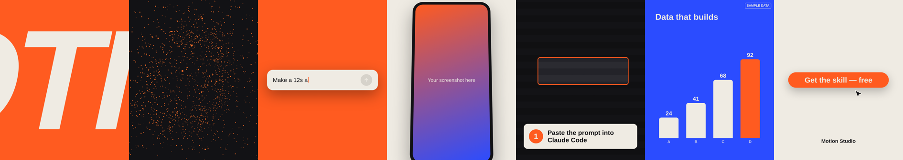

# Motion Studio

**Free Claude skills that turn a one-line brief into a finished motion graphic.** Ads, tutorials and brand reels as frame-perfect 60fps MP4s in 4:5, 9:16, 1:1 or 16:9 — no After Effects, no editor, no templates to buy.

**[▶ Watch the 15-second showreel](docs/showreel-4x5.mp4)**

<p align="center"></p>

*Every frame above was rendered from the template pack in this repo.*

## What's inside

| | |
|---|---|
| `skills/motion-studio` | **The main skill.** A production workflow for Claude: brief → brand kit → beat-timed shot list → prototype the hardest shot → build → three independent QA checks → every format. Modes for **ads**, **tutorials** and **showcase reels**. |
| `src/` | **The template pack.** Eight Remotion templates across six animation engines, bundled into the skill at build time. |
| `skills/motion-repo-library` | Optional companion skill: clones the engines' repos locally and tells Claude where the useful demos, plugins and docs live. |

### The templates

| Template | Engine | Use it for |
|---|---|---|
| `KineticHeadline` | Remotion + Motion easing | Hooks: one oversized word per beat, colour cut each beat |
| `ParticleForm` | three.js + React Three Fiber | Depth: seeded particles assemble into a sphere, ring or helix |
| `PromptTyping` | anime.js | AI/product demos: a prompt bar types real text and sends |
| `DeviceShowcase` | Remotion + Motion spring | Proof: your screenshot in a phone or browser frame |
| `StepCallout` | Remotion + Motion spring | Tutorials: zoom to a region, ring it, numbered instruction |
| `BarBuild` | anime.js stagger | Data: bars build with count-ups (your numbers only) |
| `CtaPill` | GSAP | End cards: dot → pill → click → ripple, then holds still |
| `LottieLayer` | lottie-web | Any Lottie JSON, frame-locked |

## Install

**Claude Code** (recommended — it renders on your machine). Needs Node.js 20+.
```sh
git clone https://github.com/estebantobon/motion-studio.git
cd motion-studio
npm run install:skills      # builds and copies both skills to ~/.claude/skills
```
Then make an empty folder for your videos, open a terminal there and run `claude`.

**Claude.ai:** download `motion-studio.skill` from the [latest release](../../releases/latest) and upload it under Skills in Claude's settings. Planning works there; use Claude Code for reliable rendering.

## Use
> Make a 12s 4:5 ad for https://yoursite.com — takeaway: "Launch videos in 10 minutes", CTA: "Free at the link in comments". Screenshots are in ./assets.

> Make a 45s 16:9 tutorial of these five steps. Screenshots are in ./assets/steps.

You get a shot list first, then stills of the hardest moment to approve, then the MP4, the editable Remotion project and a QA report. Plan on 30–45 minutes per video, most of it rendering.

## Play with the templates directly
```sh
npm install
npm run studio          # live preview of every template
npm run reel            # render the 4:5 showreel to out/
npm run reel:vertical   # 9:16 version
```
Restyle everything in `src/lib/theme.ts`.

## How it stays frame-perfect
Remotion renders frames out of order across parallel browser tabs, so nothing may run on a real-time clock. `src/engines/` holds a small adapter per engine: GSAP and anime.js build a paused timeline over a plain state object and seek it to the current frame; Motion contributes easing curves and a spring evaluated at the frame; three.js reads the frame number with seeded randomness; Lottie is frame-locked by `@remotion/lottie`.

## Repo layout
```
skills/motion-studio/        SKILL.md, references (modes, engines, QA), QA script
skills/motion-repo-library/  repo list, clone script, engine guides
src/                         template pack (lib, engines, templates, showreel)
scripts/                     build-skills.sh, install-skills.sh
docs/                        showreel + contact sheet
```
`npm run build:skills` writes installable `.skill` and `.zip` files to `dist/`. Publishing a GitHub release attaches them automatically.

## License
MIT © 2026 Esteban Tobón. Free to use, remix and share. Engines and Remotion keep their own licenses; see [CREDITS.md](CREDITS.md).
